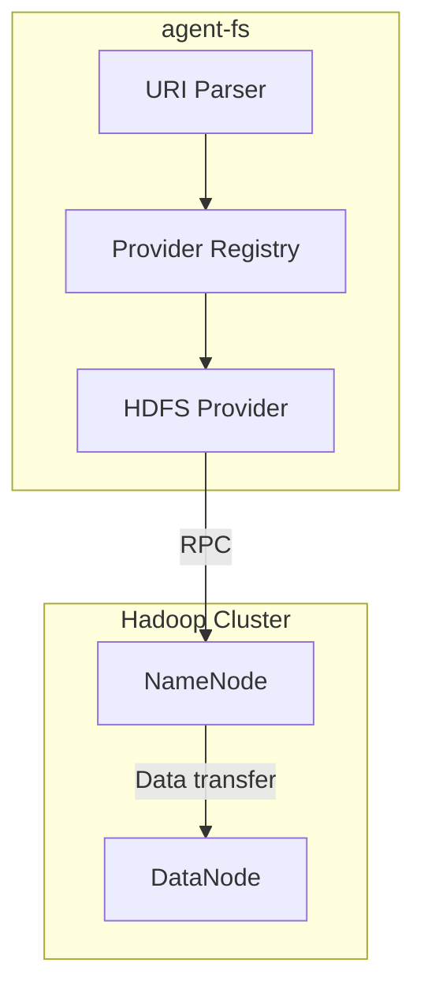

# HDFS Provider 实现计划

## 概述

为 agent-fs 添加 HDFS 存储提供者支持，使用 RPC 协议直连 NameNode。

## 技术选型

- **连接方式**: RPC 协议（直连 NameNode）
- **客户端库**: `github.com/colinmarc/hdfs/v2`（纯 Go 实现）
- **无 CGO 依赖**: 纯 Go 实现
- **默认端口**: 9866（HDFS RPC 端口）

## 架构设计



## 实现步骤

### 1. 添加依赖

```bash
go get github.com/colinmarc/hdfs/v2
```

### 2. 创建 HDFS Provider 基础结构

**文件**: `pkg/provider/hdfs_provider.go`

实现 `StorageProvider` 接口：
```go
import hdfs "github.com/colinmarc/hdfs/v2"

type HDFSProvider struct {
    namenodeAddr string
    username     string
    client       *hdfs.Client
}
```

### 3. 实现 StorageProvider 接口方法

| 方法 | 实现 |
|------|------|
| `Scheme()` | 返回 `"hdfs"` |
| `Read()` | `client.Open(path)` |
| `Write()` | `client.Create(path)` |
| `Delete()` | `client.Delete(path)` |
| `List()` | `client.ListStatus(path)` |
| `Stat()` | `client.Stat(path)` |
| `Exists()` | 调用 `client.Stat` 并处理异常 |
| `Copy()` | Read + Write 组合实现 |
| `ConfigInfo()` | 返回配置信息 |

### 4. 配置管理

环境变量配置：
- `HDFS_NAMENODE_ADDRS`: NameNode 地址（默认: `localhost:9866`，RPC 端口）
- `HDFS_USERNAME`: HDFS 用户名（默认: `hadoop`）

### 5. URI Parser 支持

**文件**: `pkg/uri/parser.go`

添加 `hdfs` scheme 支持：
```go
case "hdfs":
    return parseHDFSURI(rest)
```

URI 格式: `hdfs://namenode:9866/path/to/file`

### 6. 注册 Provider

**文件**: `pkg/provider/hdfs_provider.go`

```go
func init() {
    Register("hdfs", NewHDFSProvider)
}
```

## 文件清单

| 文件 | 描述 |
|------|------|
| `pkg/provider/hdfs_provider.go` | HDFS Provider 主实现 |
| `pkg/provider/hdfs_stub.go` | 无 WebHDFS 依赖时的存根 |

## 依赖变更

**go.mod** 新增：
```
github.com/colinmarc/hdfs/v2 v2.7.0
```

## 验收标准

1. ✅ `go build ./...` 编译通过
2. ✅ `go test ./...` 测试通过
3. ✅ 支持的 URI scheme 包含 `hdfs`
4. ✅ 基本文件操作可用（Read/Write/List/Stat/Delete）

## 参考资料

- colinmarc/hdfs: https://github.com/colinmarc/hdfs
- Hadoop RPC: https://hadoop.apache.org/docs/current/hadoop-project-dist/hadoop-hdfs/HdfsRpc.html