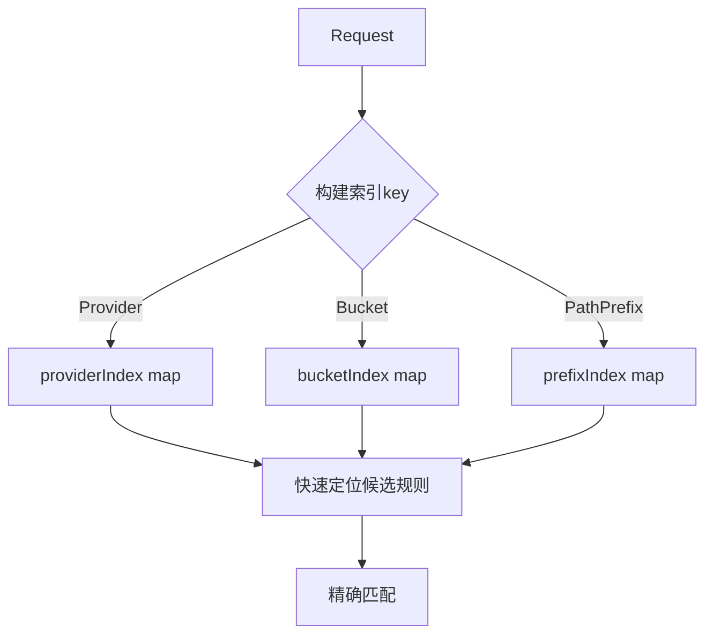

# 权限系统架构分析与优化建议

## 一、当前架构概述

```
┌─────────────────────────────────────────────────────────────────┐
│                         Manager                                  │
│  ┌─────────────────┐  ┌──────────────┐  ┌─────────────────────┐  │
│  │ userRoleMapping │  │ Engine       │  │ Config              │  │
│  │ (用户角色映射)    │  │ (规则引擎)    │  │ (配置管理)          │  │
│  └────────┬────────┘  └──────┬───────┘  └─────────────────────┘  │
│           │                 │                                    │
│           └────────┬────────┘                                    │
│                    ▼                                             │
│           ┌────────────────┐                                    │
│           │   Check()      │ ──► Request ► Result               │
│           │  (权限检查)    │                                    │
│           └────────┬───────┘                                    │
└────────────────────┼───────────────────────────────────────────┘
                     │
          ┌──────────▼──────────┐
          │      Engine        │
          │ ┌────────────────┐ │
          │ │ policies []Policy│
          │ ├────────────────┤ │
          │ │ roles map      │ │
          │ ├────────────────┤ │
          │ │ regexCache     │ │
          │ └────────────────┘ │
          └──────────┬──────────┘
                     │
       ┌─────────────┼─────────────┐
       ▼             ▼             ▼
┌────────────┐ ┌──────────┐ ┌──────────┐
│ checkRules │ │checkRoles│ │default   │
│ (规则匹配) │ │ (角色检查) │ │ (默认)   │
└─────┬──────┘ └────┬─────┘ └──────────┘
      │             │
      ▼             ▼
┌──────────────────────────────────────┐
│            Role                       │
│ ┌─────────────────────────────────┐  │
│ │ permSet (权限缓存 O(1))         │  │
│ │ providerSet (Provider缓存 O(1)) │  │
│ │ bucketSet (Bucket缓存 O(1))     │  │
│ └─────────────────────────────────┘  │
└──────────────────────────────────────┘
```

## 二、发现的问题与优化建议

### 问题 1: 代码重复 🚨

**位置:**
- [`engine.go:166-181`](pkg/permission/engine.go:166) - `checkRoles()` 函数
- [`rbac.go:18-38`](pkg/permission/rbac.go:18) - `Check()` 函数

**问题描述:**
两个函数实现几乎完全相同的角色检查逻辑，存在代码重复。

**建议:**
将角色检查逻辑提取为 Role 类的独立方法，Engine 和 RBAC 复用：
```go
// 在 Role 中已有 HasPermissionWithContext，可直接复用
// 关键是消除 Engine.checkRoles 和 RBAC.Check 的重复
```

### 问题 2: 策略/规则查找无索引 🚨

**位置:**
- [`engine.go:316-332`](pkg/permission/engine.go:316) - `getAllRulesSorted()` 每次调用都遍历所有策略

**问题描述:**
- 每次权限检查都重新排序所有规则 (O(n log n))
- Provider/Bucket/PathPrefix 匹配使用线性扫描 (O(n))

**建议:**


新增索引结构:
```go
type RuleIndex struct {
    byProvider map[string][]Rule
    byBucket   map[string][]Rule
    byPathPrefix map[string][]Rule
    // 全量规则用于无索引匹配
    allRules []Rule
}
```

### 问题 3: contains 函数可优化为 map 🔶

**位置:**
- [`engine.go:409-420`](pkg/permission/engine.go:409) - `contains()` 函数使用 slice 遍历

**问题描述:**
每次匹配都使用 O(n) 的 slice 遍历，可优化为 map 查找 O(1)。

**当前代码:**
```go
func contains(slice []string, item string) bool {
    for _, s := range slice {
        if s == item {
            return true
        }
    }
    return false
}
```

**建议:**
在 RuleMatchConditions 或 Engine 中添加缓存:
```go
type MatchConditionCache struct {
    providerMap map[string]struct{}
    bucketMap   map[string]struct{}
    extMap      map[string]struct{}
}
```

### 问题 4: 全局状态污染 🔶

**位置:**
- [`engine.go:26-37`](pkg/permission/engine.go:26) - 全局 `pathNormalizer` 变量

**问题描述:**
使用全局变量存储路径规范化器，难以进行单元测试，且非线程安全。

**建议:**
使用依赖注入:
```go
type Engine struct {
    mu            sync.RWMutex
    policies      []Policy
    roles         map[string]*Role
    regexCache    map[string]*regexp.Regexp
    pathNormalizer PathNormalizer  // 实例级别，而非全局
}
```

### 问题 5: RBAC 独立存在意义不明确 🔶

**位置:**
- [`rbac.go`](pkg/permission/rbac.go) 整个文件

**问题描述:**
- RBAC 与 Engine 功能高度重叠
- Engine 已包含完整的 RBAC 功能 (checkRoles)
- RBAC 无法单独使用，必须配合 Manager/Engine

**建议:**
- 选项1: 移除 RBAC 类，统一使用 Engine
- 选项2: 让 RBAC 成为 Engine 的轻量替代，仅用于简单场景

### 问题 6: 潜在内存泄漏隐患 🔶

**位置:**
- [`engine.go:292`](pkg/permission/engine.go:292) - regexCache 无上限增长
- [`role.go:59-81`](pkg/permission/role.go:59) - Role 的缓存字段无清理机制

**问题描述:**
- 正则缓存只增不减
- 如果配置中动态添加大量正则表达式/Permission，会导致内存持续增长

**建议:**
- 添加 LRU 淘汰策略或缓存大小限制
- 添加缓存统计和健康检查接口

### 问题 7: Manager 中的不必要拷贝 🔶

**位置:**
- [`manager.go:110-114`](pkg/permission/manager.go:110)

```go
userMapping := make(map[string][]string, len(m.userRoleMapping))
for k, v := range m.userRoleMapping {
    userMapping[k] = v
}
```

**问题描述:**
每次权限检查都复制整个 userRoleMapping，效率低下。

**建议:**
使用 RWMutex 保护，直接读取即可（当前已使用 RLock）

## 三、性能优化效果预估

| 优化项 | 当前复杂度 | 优化后 | 改进幅度 |
|--------|-----------|--------|---------|
| 规则排序 | O(n log n) 每次检查 | O(1) 更新时排序 | 显著 |
| Provider 匹配 | O(n) | O(1) | 高 |
| Bucket 匹配 | O(n) | O(1) | 高 |
| 权限检查 | O(n) | O(1) | 已完成 |
| 正则编译 | 每次编译 | 缓存命中 | 已完成 |

## 四、推荐实施优先级

1. **高优先级 (立即修复)**
   - 问题1: 代码重复重构
   - 问题2: 添加规则索引

2. **中优先级 (下一迭代)**
   - 问题3: contains 函数优化
   - 问题4: 依赖注入改造

3. **低优先级 (可选)**
   - 问题5: RBAC 合并或移除
   - 问题6: 缓存淘汰策略
   - 问题7: 内存拷贝优化

## 五、架构演进建议

```
当前状态:
  Manager -> Engine -> [Policy + Role]

建议演进:
  Manager -> Engine -> [RuleIndex + Cache + Evaluator]
                    -> [Role + ConstraintCache]
```

关键改进点:
1. 引入 RuleIndex 数据结构加速规则匹配
2. 统一的权限评估接口 (Evaluator)
3. 可配置的缓存策略 (LRU/TTL)
4. 依赖注入替代全局状态