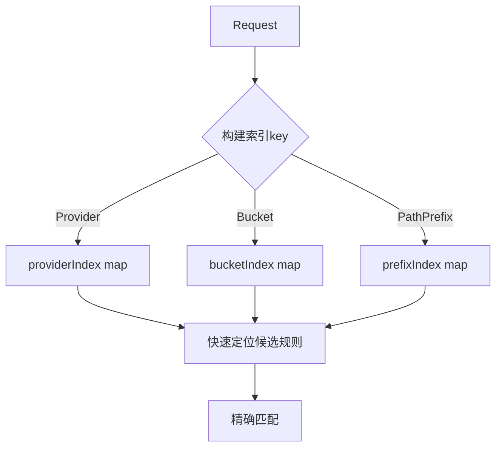

# 权限系统架构分析与优化建议

## 一、当前架构概述

```
┌─────────────────────────────────────────────────────────────────┐
│                         Manager                                  │
│  ┌─────────────────┐  ┌──────────────┐  ┌─────────────────────┐  │
│  │ userRoleMapping │  │ Engine       │  │ Config              │  │
│  │ (用户角色映射)    │  │ (规则引擎)    │  │ (配置管理)          │  │
│  └────────┬────────┘  └──────┬───────┘  └─────────────────────┘  │
│           │                 │                                    │
│           └────────┬────────┘                                    │
│                    ▼                                             │
│           ┌────────────────┐                                    │
│           │   Check()      │ ──► Request ► Result               │
│           │  (权限检查)    │                                    │
│           └────────┬───────┘                                    │
└────────────────────┼───────────────────────────────────────────┘
                     │
          ┌──────────▼──────────┐
          │      Engine        │
          │ ┌────────────────┐ │
          │ │ policies []Policy│
          │ ├────────────────┤ │
          │ │ roles map      │ │
          │ ├────────────────┤ │
          │ │ regexCache     │ │
          │ └────────────────┘ │
          └──────────┬──────────┘
                     │
       ┌─────────────┼─────────────┐
       ▼             ▼             ▼
┌────────────┐ ┌──────────┐ ┌──────────┐
│ checkRules │ │checkRoles│ │default   │
│ (规则匹配) │ │ (角色检查) │ │ (默认)   │
└─────┬──────┘ └────┬─────┘ └──────────┘
      │             │
      ▼             ▼
┌──────────────────────────────────────┐
│            Role                       │
│ ┌─────────────────────────────────┐  │
│ │ permSet (权限缓存 O(1))         │  │
│ │ providerSet (Provider缓存 O(1)) │  │
│ │ bucketSet (Bucket缓存 O(1))     │  │
│ └─────────────────────────────────┘  │
└──────────────────────────────────────┘
```

## 二、发现的问题与优化建议

### 问题 1: 代码重复 ⚠️ 仍存在

**位置:**
- [`engine.go:486-500`](pkg/permission/engine.go:486) - `checkRoles()` 函数
- [`rbac.go:18-38`](pkg/permission/rbac.go:18) - `Check()` 函数

**问题描述:**
两个函数实现几乎完全相同的角色检查逻辑，存在代码重复。

**建议:**
将角色检查逻辑提取为 Role 类的独立方法，Engine 和 RBAC 复用：
```go
// 在 Role 中已有 HasPermissionWithContext，可直接复用
// 关键是消除 Engine.checkRoles 和 RBAC.Check 的重复
```

### 问题 2: 策略/规则查找无索引 ✅ 已解决

**位置:**
- [`engine.go:63-101`](pkg/permission/engine.go:63) - `RuleIndex` 结构体已实现

**问题描述:**
- ~~每次权限检查都重新排序所有规则 (O(n log n))~~
- ~~Provider/Bucket/PathPrefix 匹配使用线性扫描 (O(n))~~

**已实现方案:**


已实现索引结构（见 [`RuleIndex`](pkg/permission/engine.go:63)）:
- `byProvider map[string][]Rule` - 按 Provider 索引
- `byBucket map[string][]Rule` - 按 Bucket 索引
- `byPathPrefix []pathPrefixRule` - 按路径前缀索引
- [`CandidatesFor()`](pkg/permission/engine.go:227) 方法实现快速候选规则定位

### 问题 3: contains 函数可优化为 map ⏳ 已改进

**位置:**
- [`engine.go:77-81`](pkg/permission/engine.go:77) - `RuleIndex` 中的 map set 实现

**问题描述:**
~~每次匹配都使用 O(n) 的 slice 遍历，可优化为 map 查找 O(1)。~~

**已实现方案:**
在 `RuleIndex` 和 `Role` 中已添加 map set 缓存:
```go
// RuleIndex 中的 map set（engine.go:77-81）
providerSet map[string]struct{}  // O(1) Provider 查找
bucketSet   map[string]struct{}  // O(1) Bucket 查找
extSet      map[string]struct{}  // O(1) Extension 查找
```

相关方法:
- [`HasProvider()`](pkg/permission/engine.go:181) - O(1) Provider 检查
- [`HasBucket()`](pkg/permission/engine.go:189) - O(1) Bucket 检查
- [`HasExtension()`](pkg/permission/engine.go:197) - O(1) Extension 检查

### 问题 4: 缺乏单元测试覆盖 ⚠️ 部分改进

**位置:**
- [`permission_test.go`](pkg/permission/permission_test.go) - 基础测试已存在

**问题描述:**
- 已添加基础测试用例
- 测试覆盖率仍需进一步提升

**建议:**
- 增加边界条件测试
- 增加并发场景测试
- 增加索引构建和查询的专项测试

### 问题 5: RBAC 独立存在意义不明确 ⚠️ 仍存在

**位置:**
- [`rbac.go`](pkg/permission/rbac.go) 整个文件

**问题描述:**
- RBAC 与 Engine 功能高度重叠
- Engine 已包含完整的 RBAC 功能 (checkRoles)
- RBAC 无法单独使用，必须配合 Manager/Engine

**建议:**
- 选项1: 移除 RBAC 类，统一使用 Engine
- 选项2: 让 RBAC 成为 Engine 的轻量替代，仅用于简单场景

### 问题 6: 潜在内存泄漏隐患 ✅ 已解决

**位置:**
- [`engine.go:286`](pkg/permission/engine.go:286) - `maxRegexCacheSize = 100`
- [`engine.go:294`](pkg/permission/engine.go:294) - `regexCache *LRUCache` LRU 缓存

**问题描述:**
~~正则缓存只增不减~~
~~如果配置中动态添加大量正则表达式/Permission，会导致内存持续增长~~

**已实现方案:**
- 添加 LRU 缓存淘汰策略，最大容量限制为 100
- 使用 [`LRUCache`](pkg/permission/engine.go:294) 替代无限增长的 map

### 问题 7: Manager 中的不必要拷贝 ✅ 已解决

**位置:**
- [`manager.go:118-127`](pkg/permission/manager.go:118) - `CheckPermission()` 已优化

**问题描述:**
~~每次权限检查都复制整个 userRoleMapping，效率低下~~

**已实现方案:**
使用 RWMutex 保护，直接读取（无需复制）:
```go
func (m *Manager) CheckPermission(ctx context.Context, req Request) Result {
    m.mu.RLock()
    enabled := m.enabled
    var roles []string
    var hasRoles bool
    if req.CurrentUser != "" {
        roles, hasRoles = m.userRoleMapping[req.CurrentUser]
    }
    m.mu.RUnlock()
    // ...
}
```

## 三、性能优化效果预估

| 优化项 | 当前复杂度 | 优化后 | 改进幅度 | 状态 |
|--------|-----------|--------|---------|------|
| 规则排序 | O(n log n) 每次检查 | O(1) 更新时排序 | 显著 | ✅ 已完成 |
| Provider 匹配 | O(n) | O(1) | 高 | ✅ 已完成 |
| Bucket 匹配 | O(n) | O(1) | 高 | ✅ 已完成 |
| 权限检查 | O(n) | O(1) | 高 | ✅ 已完成 |
| 正则编译缓存 | 每次编译 | LRU 缓存命中 | 高 | ✅ 已完成 |
| Extension 匹配 | O(n) | O(1) | 中 | ✅ 已完成 |

## 四、推荐实施优先级

1. **高优先级 (立即修复)**
   - ~~问题2: 添加规则索引~~ ✅ 已完成
   - ~~问题6: 缓存淘汰策略~~ ✅ 已完成（LRU 缓存）
   - ~~问题7: 内存拷贝优化~~ ✅ 已完成

2. **中优先级 (下一迭代)**
   - 问题1: 代码重复重构（Engine.checkRoles 与 RBAC.Check）
   - 问题4: 缺乏单元测试覆盖（部分改进，需继续完善）

3. **低优先级 (可选)**
   - 问题5: RBAC 合并或移除
   - 问题4: 依赖注入改造（全局 pathNormalizer 问题）

## 五、架构演进建议

```
当前状态（已实现）:
  Manager -> Engine -> [RuleIndex + LRUCache + Evaluator]
                    -> [Role + ConstraintCache]

已完成的改进:
  ✅ RuleIndex 数据结构加速规则匹配
  ✅ 统一的权限评估接口 (Evaluator)
  ✅ LRU 缓存策略（maxRegexCacheSize = 100）
  ✅ Role 中的 permSet/providerSet/bucketSet 缓存

待改进项:
  ⏳ 依赖注入替代全局状态（pathNormalizer）
  ⏳ Engine.checkRoles 与 RBAC.Check 代码重复
  ⏳ 增加单元测试覆盖率
```

关键改进点:
1. ✅ 引入 RuleIndex 数据结构加速规则匹配
2. ✅ 统一的权限评估接口 (Evaluator)
3. ✅ 可配置的缓存策略 (LRU)
4. ⏳ 依赖注入替代全局状态