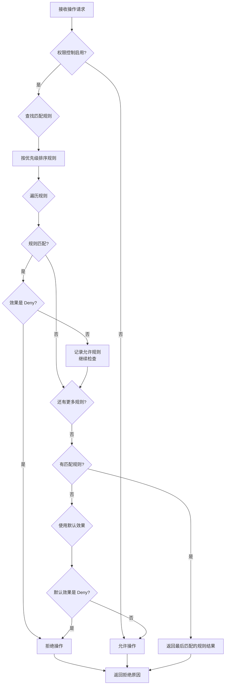

# 文件权限控制系统设计方案

## 1. 概述

本文档为 agent-fs 项目设计文件权限控制系统，目标是针对覆盖（overwrite）、删除（delete）、复制（copy）、移动（move）等操作实施权限控制。该系统基于**分层优先级策略模型**设计，支持多存储后端的统一权限管理。

## 2. 项目背景与需求分析

### 2.1 项目背景

agent-fs 是一个专为 AI Agent 设计的跨平台文件操作 CLI 工具，支持多种存储后端：
- 本地文件系统（file）
- Amazon S3
- Cloudflare R2
- MinIO
- 阿里云 OSS
- 腾讯云 COS
- CephFS

现有安全机制：
- **sandbox 机制**：`pkg/sandbox` 包提供路径穿越保护，限制文件操作在指定工作目录内
- **provider 模式**：统一的 StorageProvider 接口抽象不同存储后端

### 2.2 权限控制需求

针对以下操作实施权限控制：

| 操作 | 操作类型 | 说明 |
|------|---------|------|
| overwrite | 写入 | 覆盖已有文件 |
| delete | 删除 | 删除文件或目录 |
| copy | 复制 | 复制文件或目录 |
| move | 移动 | 移动/重命名文件或目录 |

### 2.3 设计原则

1. **最小权限原则**：默认拒绝所有危险操作
2. **分层匹配**：路径规则 > Provider 规则 > 全局规则
3. **配置优先**：通过配置文件定义权限策略
4. **可扩展性**：支持自定义权限检查器
5. **兼容性**：不破坏现有 provider 接口

## 3. 权限模型设计

### 3.1 权限类型定义

```go
// pkg/permission/types.go

// Permission 表示权限操作类型
type Permission string

const (
    PermissionRead    Permission = "read"     // 读取文件
    PermissionWrite   Permission = "write"    // 写入新文件
    PermissionOverwrite Permission = "overwrite" // 覆盖已有文件
    PermissionDelete  Permission = "delete"   // 删除文件
    PermissionCopy    Permission = "copy"      // 复制操作
    PermissionMove   Permission = "move"       // 移动操作
)

// Effect 表示规则匹配后的效果
type Effect string

const (
    EffectAllow Effect = "allow"  // 允许操作
    EffectDeny  Effect = "deny"   // 拒绝操作
)
```

### 3.2 规则结构设计

```go
// pkg/permission/rule.go

// RuleMatchConditions 定义规则匹配条件
type RuleMatchConditions struct {
    // 按路径前缀匹配（支持通配符）
    PathPrefix []string `mapstructure:"path_prefix"`
    // 按路径正则匹配
    PathRegex []string `mapstructure:"path_regex"`
    
    // 按 provider scheme 匹配
    Provider []string `mapstructure:"provider"`
    // 按 bucket 匹配（云存储）
    Bucket []string `mapstructure:"bucket"`
    
    // 按文件扩展名匹配
    Extension []string `mapstructure:"extension"`
    
    // 按操作类型匹配
    Operations []Permission `mapstructure:"operations"`
    
    // 文件大小范围（字节）
    MinSize int64 `mapstructure:"min_size"`
    MaxSize int64 `mapstructure:"max_size"`
}

// Rule 定义一条权限规则
type Rule struct {
    // 规则名称（唯一标识）
    Name string `mapstructure:"name"`
    // 规则描述
    Description string `mapstructure:"description"`
    
    // 匹配条件
    Match RuleMatchConditions `mapstructure:"match"`
    
    // 权限效果
    Effect Effect `mapstructure:"effect"`
    
    // 优先级（数值越小优先级越高）
    Priority int `mapstructure:"priority"`
    
    // 是否启用
    Enabled bool `mapstructure:"enabled"`
}

// Policy 定义一组规则及其默认行为
type Policy struct {
    // 策略名称
    Name string `mapstructure:"name"`
    // 默认效果（当没有规则匹配时）
    DefaultEffect Effect `mapstructure:"default_effect"`
    
    // 规则列表
    Rules []Rule `mapstructure:"rules"`
    
    // 是否启用
    Enabled bool `mapstructure:"enabled"`
}
```

### 3.3 配置示例

```yaml
# ~/.afs-permission.yaml

permission:
  enabled: true
  
  # 策略配置
  policies:
    - name: "default"
      default_effect: "deny"  # 默认拒绝危险操作
      
      rules:
        # 允许覆盖特定目录下的文件
        - name: "allow-overwrite-temp"
          description: "允许覆盖临时目录下的文件"
          priority: 100
          enabled: true
          match:
            path_prefix: ["/tmp/", "s3://bucket/temp/"]
            operations: ["overwrite"]
          effect: "allow"
        
        # 禁止删除特定 bucket 的文件
        - name: "deny-delete-production"
          description: "禁止删除生产环境的文件"
          priority: 50
          enabled: true
          match:
            provider: ["s3", "r2"]
            bucket: ["production-*"]
            operations: ["delete"]
          effect: "deny"
        
        # 允许复制到特定目录
        - name: "allow-copy-to-backup"
          description: "允许复制到备份目录"
          priority: 100
          enabled: true
          match:
            path_prefix: ["s3://backup/", "/backup/"]
            operations: ["copy", "move"]
          effect: "allow"
        
        # 禁止移动敏感目录
        - name: "deny-move-sensitive"
          description: "禁止移动敏感目录"
          priority: 10
          enabled: true
          match:
            path_prefix: ["s3://data/confidential/", "/etc/"]
            operations: ["move"]
          effect: "deny"
        
        # 允许 overwrite 操作（需要明确配置）
        - name: "allow-overwrite-workspace"
          description: "允许覆盖工作空间文件"
          priority: 150
          enabled: true
          match:
            operations: ["overwrite"]
            path_prefix: ["s3://workspace/", "/workspace/"]
          effect: "allow"
```

## 4. 接口设计

### 4.1 权限检查器接口

```go
// pkg/permission/checker.go

// Request 包含需要检查的操作请求
type Request struct {
    // 操作类型
    Operation Permission
    // 源路径（对于 copy/move）
    SourcePath string
    // 目标路径（对于 copy/move/overwrite）
    TargetPath string
    // Provider scheme
    Provider string
    // Bucket（云存储）
    Bucket string
    // 文件大小
    FileSize int64
    // 文件扩展名
    Extension string
}

// Result 权限检查结果
type Result struct {
    // 是否允许操作
    Allowed bool
    // 匹配的规则名称
    MatchedRule string
    // 拒绝原因
    Reason string
    // 错误信息
    Error error
}

// PermissionChecker 权限检查器接口
type PermissionChecker interface {
    // Check 检查操作是否允许
    Check(ctx context.Context, req Request) Result
    
    // LoadPolicies 从配置加载策略
    LoadPolicies(configs []Policy) error
    
    // AddPolicy 添加策略
    AddPolicy(policy Policy) error
    
    // RemovePolicy 移除策略
    RemovePolicy(name string) error
}
```

### 4.2 Provider 接口扩展

在 `pkg/provider/provider.go` 中扩展 StorageProvider 接口：

```go
// StorageProvider 存储提供者接口（扩展）

type StorageProvider interface {
    // 现有方法...
    Scheme() string
    Read(ctx context.Context, path string) (io.ReadCloser, error)
    Write(ctx context.Context, path string, data io.Reader) error
    Delete(ctx context.Context, path string) error
    List(ctx context.Context, path string) ([]FileInfo, error)
    Stat(ctx context.Context, path string) (*FileInfo, error)
    Exists(ctx context.Context, path string) (bool, error)
    Copy(ctx context.Context, srcPath, dstPath string) error
    ConfigInfo() ProviderConfigInfo
    
    // ========== 新增方法 ==========
    
    // SupportPermissionCheck 返回是否支持权限检查
    SupportPermissionCheck() bool
    
    // CheckPermission 检查特定操作权限（可选实现）
    CheckPermission(ctx context.Context, op Permission, path string) (bool, error)
}
```

### 4.3 操作上下文

```go
// pkg/permission/context.go

// OperationContext 包含操作执行时的上下文信息
type OperationContext struct {
    // 操作类型
    Operation Permission
    // 源 URI
    SourceURI string
    // 目标 URI
    TargetURI string
    // 解析后的 URI 信息
    SourceParsed *uri.URI
    TargetParsed *uri.URI
    // 请求 ID（用于日志追踪）
    RequestID string
    // 用户信息
    User string
}

// NewOperationContext 创建操作上下文
func NewOperationContext(op Permission, source, target string, parsedSrc, parsedTgt *uri.URI) *OperationContext {
    return &OperationContext{
        Operation:    op,
        SourceURI:    source,
        TargetURI:    target,
        SourceParsed: parsedSrc,
        TargetParsed: parsedTgt,
        RequestID:    uuid.New().String(),
    }
}
```

## 5. 实现策略

### 5.1 核心架构

```
┌─────────────────────────────────────────────────────────────────┐
│                        cmd/fs.go                                │
│                   (操作入口：runFsCp 等)                         │
└──────────────────────────┬──────────────────────────────────────┘
                           │
                           ▼
┌─────────────────────────────────────────────────────────────────┐
│                   pkg/permission/manager.go                     │
│                       权限管理器                                  │
│  ┌─────────────┐  ┌─────────────┐  ┌─────────────────────────┐  │
│  │ PolicyLoader│  │ RuleMatcher│  │ PermissionChecker      │  │
│  │             │  │             │  │ (分层匹配引擎)           │  │
│  └─────────────┘  └─────────────┘  └─────────────────────────┘  │
└──────────────────────────┬──────────────────────────────────────┘
                           │
                           ▼
┌─────────────────────────────────────────────────────────────────┐
│                    StorageProvider                              │
│         (本地/S3/OSS/COS 等 providers)                          │
└─────────────────────────────────────────────────────────────────┘
```

### 5.2 权限管理器

```go
// pkg/permission/manager.go

// Manager 权限管理器
type Manager struct {
    mu       sync.RWMutex
    policies []Policy
    checker  PermissionChecker
    config   *Config
}

// Config 权限管理配置
type Config struct {
    // 是否启用权限控制
    Enabled bool
    // 配置文件路径
    ConfigPath string
    // 严格模式（无匹配规则时拒绝）
    StrictMode bool
}

// NewManager 创建权限管理器
func NewManager(cfg *Config) (*Manager, error) {
    m := &Manager{
        config:  cfg,
        policies: []Policy{},
        checker:  NewDefaultChecker(),
    }
    
    if cfg.Enabled && cfg.ConfigPath != "" {
        if err := m.LoadFromFile(cfg.ConfigPath); err != nil {
            return nil, err
        }
    }
    
    return m, nil
}

// CheckPermission 检查权限
func (m *Manager) CheckPermission(ctx context.Context, req Request) Result {
    if !m.config.Enabled {
        // 权限控制未启用，允许所有操作
        return Result{Allowed: true, Reason: "permission control disabled"}
    }
    
    m.mu.RLock()
    defer m.mu.RUnlock()
    
    return m.checker.Check(ctx, req)
}

// CheckOperationPermission 便捷方法：检查操作权限
func (m *Manager) CheckOperationPermission(
    ctx context.Context,
    op Permission,
    path string,
    provider string,
    bucket string,
) (bool, string, error) {
    req := Request{
        Operation: op,
        TargetPath: path,
        Provider:   provider,
        Bucket:     bucket,
    }
    
    result := m.CheckPermission(ctx, req)
    return result.Allowed, result.Reason, result.Error
}
```

### 5.3 分层匹配引擎

```go
// pkg/permission/engine.go

// Engine 分层匹配引擎
type Engine struct {
    policies []Policy
}

// Check 执行权限检查
func (e *Engine) Check(ctx context.Context, req Request) Result {
    var matchedRule *Rule
    var lastEffect Effect
    
    // 按优先级排序规则（优先级数值越小越先匹配）
    allRules := e.getAllRulesSorted()
    
    for _, rule := range allRules {
        if !rule.Enabled {
            continue
        }
        
        if e.matchRule(rule, req) {
            matchedRule = &rule
            lastEffect = rule.Effect
            
            // 如果是否决规则，立即拒绝
            if rule.Effect == EffectDeny {
                return Result{
                    Allowed:    false,
                    MatchedRule: rule.Name,
                    Reason:     fmt.Sprintf("denied by rule: %s", rule.Description),
                }
            }
            // 如果是允许规则，继续检查是否有更高优先级的拒绝规则
        }
    }
    
    // 没有匹配到任何规则
    if matchedRule == nil {
        // 使用默认策略
        return Result{
            Allowed:    true, // 默认允许读取
            MatchedRule: "",
            Reason:     "no matching rule, using default",
        }
    }
    
    return Result{
        Allowed:    true,
        MatchedRule: matchedRule.Name,
        Reason:     fmt.Sprintf("allowed by rule: %s", matchedRule.Description),
    }
}

// matchRule 检查规则是否匹配请求
func (e *Engine) matchRule(rule Rule, req Request) bool {
    matchCond := rule.Match
    
    // 1. 检查 Provider 匹配
    if len(matchCond.Provider) > 0 {
        if !sliceContains(matchCond.Provider, req.Provider) {
            return false
        }
    }
    
    // 2. 检查 Bucket 匹配
    if len(matchCond.Bucket) > 0 {
        if !e.matchAny(req.Bucket, matchCond.Bucket) {
            return false
        }
    }
    
    // 3. 检查路径前缀匹配
    if len(matchCond.PathPrefix) > 0 {
        if !e.matchPathPrefix(req.TargetPath, matchCond.PathPrefix) &&
           !e.matchPathPrefix(req.SourcePath, matchCond.PathPrefix) {
            return false
        }
    }
    
    // 4. 检查文件扩展名匹配
    if len(matchCond.Extension) > 0 {
        if !e.matchExtension(req.Extension, matchCond.Extension) {
            return false
        }
    }
    
    // 5. 检查操作类型匹配
    if len(matchCond.Operations) > 0 {
        if !sliceContains(matchCond.Operations, req.Operation) {
            return false
        }
    }
    
    return true
}

// matchPathPrefix 检查路径是否匹配任意前缀
func (e *Engine) matchPathPrefix(path string, prefixes []string) bool {
    for _, prefix := range prefixes {
        if strings.HasPrefix(path, prefix) {
            return true
        }
    }
    return false
}

// getAllRulesSorted 获取所有规则并按优先级排序
func (e *Engine) getAllRulesSorted() []Rule {
    var rules []Rule
    for _, policy := range e.policies {
        rules = append(rules, policy.Rules...)
    }
    
    // 按优先级排序（数值小的在前）
    sort.Slice(rules, func(i, j int) bool {
        return rules[i].Priority < rules[j].Priority
    })
    
    return rules
}
```

### 5.4 集成到命令层

在 `cmd/fs.go` 中集成权限检查：

```go
// cmd/fs.go (新增部分)

// 权限管理器实例
var permissionManager *permission.Manager

func init() {
    // 初始化权限管理器
    cfg := &permission.Config{
        Enabled:    viper.GetBool("permission.enabled"),
        ConfigPath: viper.GetString("permission.config"),
        StrictMode: viper.GetBool("permission.strict_mode"),
    }
    
    pm, err := permission.NewManager(cfg)
    if err != nil {
        // 启动失败时记录警告，但不影响运行
        fmt.Fprintf(os.Stderr, "Warning: Failed to initialize permission manager: %v\n", err)
    }
    permissionManager = pm
}

// runFsCp 修改版 - 添加权限检查
func runFsCp(src, dst string) error {
    // ... 解析路径 ...
    
    // 检查是否覆盖操作
    exists, err := dstProvider.Exists(ctx, dstPath)
    if err != nil {
        return apperr.Wrap(`fs_cp`, apperr.CodeInternal, `failed to check destination`, err)
    }
    
    var op permission.Permission
    if exists {
        op = permission.PermissionOverwrite
    } else {
        op = permission.PermissionCopy
    }
    
    // 权限检查
    if permissionManager != nil {
        allowed, reason, err := permissionManager.CheckOperationPermission(
            ctx,
            op,
            dstPath,
            dstParsed.Scheme,
            dstParsed.Bucket,
        )
        if err != nil {
            return apperr.Wrap(`fs_cp`, apperr.CodeInternal, `permission check failed`, err)
        }
        if !allowed {
            return apperr.New(`fs_cp`, apperr.CodePermissionDenied,
                fmt.Sprintf(`operation denied: %s`, reason))
        }
    }
    
    // ... 继续执行复制操作 ...
}

// runFsDelete 修改版 - 添加权限检查
func runFsDelete(path string) error {
    // ... 解析路径 ...
    
    // 权限检查
    if permissionManager != nil {
        allowed, reason, err := permissionManager.CheckOperationPermission(
            ctx,
            permission.PermissionDelete,
            filePath,
            parsed.Scheme,
            parsed.Bucket,
        )
        if err != nil {
            return apperr.Wrap(`fs_rm`, apperr.CodeInternal, `permission check failed`, err)
        }
        if !allowed {
            return apperr.New(`fs_rm`, apperr.CodePermissionDenied,
                fmt.Sprintf(`operation denied: %s`, reason))
        }
    }
    
    // ... 继续执行删除操作 ...
}
```

## 6. 优先级与冲突处理

### 6.1 优先级规则

1. **规则优先级数值越小，优先级越高**
2. **同优先级规则**：按配置顺序匹配，第一个匹配的生效
3. **分层匹配顺序**：
   - 优先级 1-50：特殊保护规则（禁止删除生产环境等）
   - 优先级 51-100：安全限制规则
   - 优先级 101-150：常规允许规则
   - 优先级 151-200：宽松规则

### 6.2 冲突处理策略

| 场景 | 处理策略 |
|------|---------|
| 多个规则匹配同一操作 | 优先级数值最小的规则生效 |
| Allow 和 Deny 冲突 | Deny 优先（优先级更高的 Deny 生效） |
| 无规则匹配 | 使用策略的 default_effect |
| default_effect 为 deny | 拒绝操作并提示用户配置规则 |

### 6.3 决策流程图



## 7. 错误码扩展

在 `pkg/apperr/error.go` 中添加权限相关错误码：

```go
const (
    // 现有错误码...
    
    // 权限错误
    CodePermissionDenied ErrorCode = "ERR_PERMISSION_DENIED"
)
```

## 8. 文件修改清单

### 8.1 新增文件

| 文件路径 | 说明 |
|---------|------|
| `pkg/permission/types.go` | 权限类型定义 |
| `pkg/permission/rule.go` | 规则结构定义 |
| `pkg/permission/checker.go` | 权限检查器接口 |
| `pkg/permission/engine.go` | 分层匹配引擎 |
| `pkg/permission/manager.go` | 权限管理器 |
| `pkg/permission/context.go` | 操作上下文 |
| `pkg/permission/config.go` | 配置加载 |
| `pkg/permission/config_test.go` | 测试 |

### 8.2 修改文件

| 文件路径 | 修改内容 |
|---------|---------|
| `pkg/provider/provider.go` | 新增 `SupportPermissionCheck()` 和 `CheckPermission()` 方法 |
| `cmd/fs.go` | 在 write/delete/copy/move 操作前添加权限检查 |
| `cmd/root.go` | 初始化权限管理器，添加配置标志 |
| `pkg/config/config.go` | 新增 `LoadPermissionConfig()` 方法 |
| `pkg/apperr/error.go` | 新增权限错误码 |

### 8.3 配置文件

| 文件路径 | 说明 |
|---------|------|
| `~/.afs-permission.yaml` | 权限策略配置文件（用户级） |

## 9. 配置格式

### 9.1 YAML 配置格式

```yaml
# 完整配置示例
permission:
  enabled: true
  strict_mode: true
  config: "~/.afs-permission.yaml"
  
  # 内联策略（与 config 文件二选一）
  policies:
    - name: "inline-policy"
      default_effect: "deny"
      rules:
        - name: "example"
          priority: 100
          enabled: true
          match:
            path_prefix: ["/workspace/"]
            operations: ["overwrite", "delete"]
          effect: "deny"
```

### 9.2 环境变量

| 变量 | 说明 | 默认值 |
|------|------|--------|
| `AFS_PERMISSION_ENABLED` | 启用权限控制 | false |
| `AFS_PERMISSION_CONFIG` | 配置文件路径 | ~/.afs-permission.yaml |
| `AFS_PERMISSION_STRICT` | 严格模式 | false |

## 10. 安全性考虑

### 10.1 防御措施

1. **路径穿越防护**：结合 sandbox 机制
2. **配置验证**：启动时验证配置合法性
3. **日志审计**：记录所有权限检查结果
4. **错误信息脱敏**：不泄露敏感路径信息

### 10.2 日志记录

```go
// 权限检查日志
log.Printf("[PERMISSION] request_id=%s operation=%s path=%s provider=%s allowed=%v rule=%s reason=%s",
    req.RequestID,
    req.Operation,
    req.TargetPath,
    req.Provider,
    result.Allowed,
    result.MatchedRule,
    result.Reason,
)
```

## 11. 测试策略

### 11.1 单元测试

- 规则匹配逻辑测试
- 优先级排序测试
- 冲突处理测试

### 11.2 集成测试

- 与 provider 集成测试
- CLI 命令集成测试

### 11.3 测试用例示例

```go
// pkg/permission/engine_test.go

func TestEngine_MatchPathPrefix(t *testing.T) {
    engine := NewEngine()
    
    tests := []struct {
        name     string
        path     string
        prefixes []string
        expected bool
    }{
        {"exact prefix", "s3://bucket/data/file.txt", []string{"s3://bucket/data/"}, true},
        {"no prefix match", "s3://bucket/other/file.txt", []string{"s3://bucket/data/"}, false},
        {"empty path", "", []string{"s3://bucket/"}, false},
        {"empty prefixes", "s3://bucket/file.txt", []string{}, false},
    }
    
    for _, tt := range tests {
        t.Run(tt.name, func(t *testing.T) {
            result := engine.matchPathPrefix(tt.path, tt.prefixes)
            assert.Equal(t, tt.expected, result)
        })
    }
}
```

## 12. 总结

本设计文档提供了一个完整的文件权限控制系统架构，核心特点包括：

1. **分层优先级策略**：支持精细化的权限控制规则
2. **统一接口设计**：通过 PermissionChecker 接口支持不同实现
3. **灵活的配置方式**：支持 YAML 配置文件和环境变量
4. **与现有架构无缝集成**：基于现有的 provider 模式和 sandbox 机制
5. **完整的错误处理和日志审计**

该方案可满足对覆盖、删除、复制、移动等危险操作的权限控制需求，同时保持系统的可扩展性和易用性。

## 十二、实施状态说明

本设计文档描述的是权限控制系统的设计目标和方案。详细实施进度请参考以下文档：

### 相关文档链接

| 文档 | 说明 |
|------|------|
| [`permission_control_implementation_plan.md`](plans/permission_control_implementation_plan.md) | 详细实施计划和进度追踪 |
| [`permission_execution_plan.md`](plans/permission_execution_plan.md) | 执行计划和里程碑状态 |
| [`permission_architecture_review.md`](plans/permission_architecture_review.md) | 架构审查和问题状态 |
| [`permission_metrics_sync_architecture_review.md`](plans/permission_metrics_sync_architecture_review.md) | Metrics同步机制审查 |

### 核心实施状态

| 设计目标 | 实施状态 |
|----------|----------|
| 权限类型定义 | ✅ 已完成 (types.go) |
| 规则引擎核心 | ✅ 已完成 (engine.go) |
| RBAC 角色-权限映射 | ✅ 已完成 (rbac.go, role.go) |
| Manager 集成层 | ✅ 已完成 (manager.go) |
| Evaluator 评估接口 | ✅ 已完成 (evaluator.go) |
| RuleIndex 索引优化 | ✅ 已完成 (engine.go RuleIndex) |
| MetricsSink 可观测性 | ✅ 已完成 (evaluator.go MetricsSink) |
| 单元测试覆盖 | ⏳ 部分完成 (permission_test.go) |