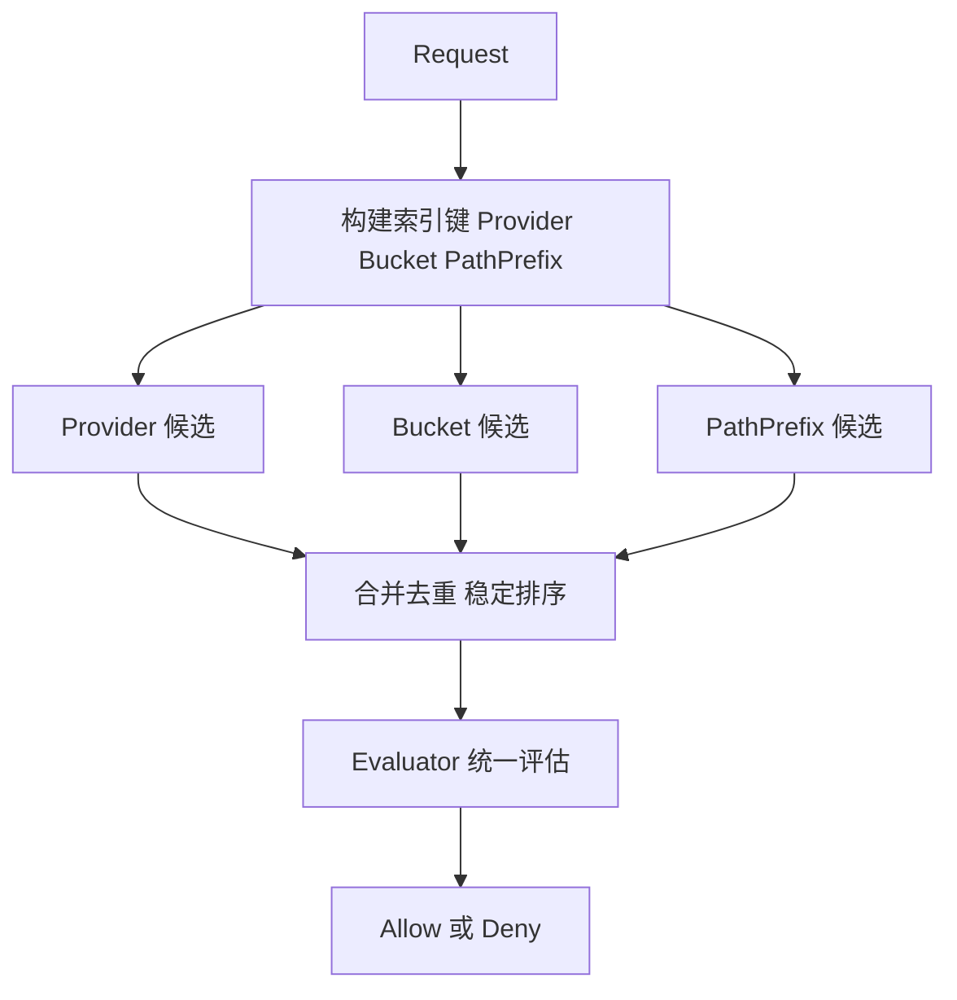
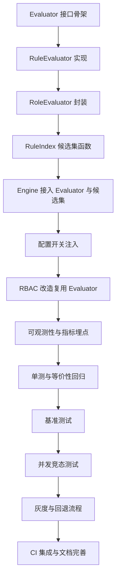

# 权限系统执行计划 A 案：索引接入主路径 + 统一 Evaluator

本文将现有执行清单细化为可落地的执行计划，包含阶段化推进、具体工作项、涉及文件、验收标准、观测指标、风险与回滚方案。

关联文档与代码参考：
- 引擎与索引实现：[pkg/permission/engine.go](pkg/permission/engine.go)
- 角色与约束缓存：[pkg/permission/role.go](pkg/permission/role.go)
- RBAC 门面与角色接口：[pkg/permission/rbac.go](pkg/permission/rbac.go)
- 配置模块：[pkg/permission/config.go](pkg/permission/config.go)
- 架构评审文档：[plans/permission_architecture_review.md](plans/permission_architecture_review.md)

----------------------------------------

一、范围与目标
- 范围
  - 在引擎主评估路径接入 RuleIndex 实现候选集收敛
  - 抽象并接入 Evaluator，使规则与角色检查走统一评估路径
  - 提供可观测能力、灰度开关与回滚方案
- 目标
  - 评估路径从全量规则遍历转为索引收敛后精判，降低延迟与提升吞吐
  - 消除 Engine 与 RBAC 重复逻辑，清晰职责边界
  - 增强安全性、可测试性与可运维性
- 非目标
  - 本期不改动策略与规则的外部配置格式
  - 不做跨进程共享缓存与分布式索引

----------------------------------------

二、总体架构蓝图

- Engine 负责编排与管控，Evaluator 聚焦评估，RuleIndex 负责候选集收敛。
- RBAC 作为 Engine 的轻量门面，复用 Evaluator 路径。

----------------------------------------

三、推进策略与阶段划分

- P0 立即执行：Evaluator 接口骨架、默认 RuleEvaluator、RoleEvaluator 封装、RuleIndex 候选集函数、Engine 接入 Evaluator、配置开关
- P1 下一迭代：RBAC 复用 Evaluator、可观测性指标与埋点、单元测试与等价性回归
- P2 后续增强：基准与并发竞态测试、灰度与回退流程、CI 集成、文档完善

----------------------------------------

四、详细执行计划

P0 立即执行

1. 定义 Evaluator 接口骨架
- 工作项
  - 新增文件：在 [pkg/permission](pkg/permission) 下创建 evaluator.go，定义 Evaluator 接口与输入输出契约
  - 说明扩展点：规则评估、角色检查、指标上报
- 涉及文件
  - [pkg/permission/evaluator.go](pkg/permission/evaluator.go)
- 实现要点
  - 接口定义应仅依赖已有类型，如 Request 与 Result，避免引入环依赖
  - 预留 MetricsSink 注入点，默认空实现
- 验收标准
  - 接口定义经代码审阅通过，编译通过，无新增依赖环

2. 实现默认评估器 RuleEvaluator
- 工作项
  - 在 [pkg/permission/evaluator.go](pkg/permission/evaluator.go) 或同目录新增实现类，将当前规则与角色引用的精确判定内聚为 RuleEvaluator
- 涉及文件
  - [pkg/permission/evaluator.go](pkg/permission/evaluator.go)
  - [pkg/permission/engine.go](pkg/permission/engine.go)
- 实现要点
  - 保持与现有逻辑的一致性：EffectDeny 优先，Allow 时若规则引用角色需继续检查角色权限
- 验收标准
  - 与现有 Engine 路径在相同输入下返回等价决策（后续回归验证）

3. 实现 RoleEvaluator
- 工作项
  - 将 [pkg/permission/role.go](pkg/permission/role.go) 的 HasPermissionWithContext 调用封装成 Evaluator，可独立评估角色约束与权限
- 涉及文件
  - [pkg/permission/evaluator.go](pkg/permission/evaluator.go)
  - [pkg/permission/role.go](pkg/permission/role.go)
- 实现要点
  - 复用 role 的缓存与约束判定，作为 RuleEvaluator 的子路径
- 验收标准
  - 独立单测覆盖不同约束组合，通过率 100

4. 构建候选集函数 candidatesFor
- 工作项
  - 在 [pkg/permission/engine.go](pkg/permission/engine.go) 的 RuleIndex 旁新增 candidatesFor 方法，按 Provider Bucket PathPrefix 组合产生候选集
- 涉及文件
  - [pkg/permission/engine.go](pkg/permission/engine.go)
- 实现要点
  - 使用 byProvider 与 byBucket 的映射交并策略
  - PathPrefix 候选按前缀长度降序匹配；合并去重后进行稳定排序
  - 兜底逻辑：若候选为空，回退为 GetSortedRules
- 验收标准
  - 候选集规模在典型场景显著低于全量规则数量；集构造逻辑单测覆盖

5. 在 Engine 接入 Evaluator 与候选集
- 工作项
  - 在 [pkg/permission/engine.go](pkg/permission/engine.go) 的主评估路径中优先调用 candidatesFor 收敛规则，再委托 Evaluator 进行精判
- 涉及文件
  - [pkg/permission/engine.go](pkg/permission/engine.go)
- 实现要点
  - 保持优先级裁决一致性，Deny 优先；角色引用校验复用 RoleEvaluator
  - 分支受配置开关控制，便于灰度与回退
- 验收标准
  - 开关关闭时行为完全等价于旧路径；开启时结果等价且性能指标达标（后续基准验证）

6. 新增配置开关 enableRuleIndexExecution
- 工作项
  - 在 [pkg/permission/config.go](pkg/permission/config.go) 增加布尔配置，默认 false
  - 在 Engine 初始化与 Manager 加载时注入该配置
- 涉及文件
  - [pkg/permission/config.go](pkg/permission/config.go)
  - [pkg/permission/engine.go](pkg/permission/engine.go)
- 实现要点
  - 配置读取失败或缺失时按默认值处理，不影响决策路径
- 验收标准
  - 可通过测试或示例配置验证开关切换生效

P1 下一迭代

7. RBAC 改造复用 Evaluator 路径
- 工作项
  - 修改 [pkg/permission/rbac.go](pkg/permission/rbac.go) 的 Check 实现，委托 Engine 或 Evaluator，移除重复逻辑，RBAC 保留为轻量门面
- 验收标准
  - RBAC 相关测试全绿，结果与旧实现一致

8. 增加可观测性
- 工作项
  - 在 Evaluator 与 Engine 注入 MetricsSink，记录 indexHits candidateCount evalDuration 与关键决策标签
- 涉及文件
  - [pkg/permission/evaluator.go](pkg/permission/evaluator.go)
  - [pkg/permission/engine.go](pkg/permission/engine.go)
- 实现要点
  - 提供空实现，避免对使用方造成侵入；支持将来接入指标系统
- 验收标准
  - 日志或内存统计可读取到上述指标，覆盖基础路径

9. 单元测试与等价性回归
- 工作项
  - 覆盖 Evaluator 行为、候选集构造、优先级与去重、角色引用流程、开关前后等价性
- 涉及文件
  - [pkg/permission/permission_test.go](pkg/permission/permission_test.go)
- 验收标准
  - 全部单元测试通过；等价性用例开关前后返回值一致

P2 后续增强

10. 基准与并发竞态测试
- 工作项
  - 新增基准测试 BenchmarkEngineCheck，统计不同规则规模与命中路径的评估耗时
  - 开启 -race 的竞态测试，覆盖 RuleIndex 重建、Evaluator 访问与 Regex LRU 并发
- 验收标准
  - 索引路径相对于旧路径平均耗时显著降低；-race 无数据竞争

11. 灰度与回退策略
- 工作项
  - 通过 enableRuleIndexExecution 开关灰度，日志记录索引路径或旧路径、候选集大小与命中规则
- 验收标准
  - 灰度与回退过程无功能回退风险，日志可用性良好

12. CI 集成与文档完善
- 工作项
  - 在 CI 中增加可选的基准步骤与 -race 作业
  - 更新 [plans/permission_architecture_review.md](plans/permission_architecture_review.md)，补充 Evaluator 设计、候选集策略、指标定义与灰度回退说明
- 验收标准
  - CI 通过；文档完整并可指导新同学接入

----------------------------------------

五、验收标准与指标定义

- 功能等价
  - 关闭 enableRuleIndexExecution 与开启状态下，在同一策略集与请求集上，决策结果一致
- 性能目标
  - 候选集平均规模显著低于全量规则数
  - 引擎评估耗时较旧路径下降显著（基准测试验证）
- 稳定性
  - -race 通过，无数据竞争
  - 索引重建与缓存一致性无泄漏或死锁风险
- 可观测性
  - 指标包含 indexHits candidateCount evalDuration 与命中规则标签；可基于日志或内存接口快速排障

----------------------------------------

六、风险与缓解

- 索引一致性风险
  - 缓解：在 [pkg/permission/engine.go](pkg/permission/engine.go) 的 LoadPolicies 与 AddPolicy 后统一重建索引；必要时提供显式重建接口
- 等价性偏差
  - 缓解：保留旧路径并通过开关切换；构建等价性回归用例集；灰度期间保留决策对比日志
- 并发访问风险
  - 缓解：RWMutex 保护索引读写；-race 常态化执行；必要时增加读写隔离副本
- 性能不达预期
  - 缓解：基准中记录候选集规模与耗时分布；针对命中率低的维度优化索引或增加新维度

----------------------------------------

七、时间线与依赖关系

----------------------------------------

八、交付物清单

- 代码
  - 新增：[pkg/permission/evaluator.go](pkg/permission/evaluator.go)
  - 修改：[pkg/permission/engine.go](pkg/permission/engine.go) [pkg/permission/rbac.go](pkg/permission/rbac.go) [pkg/permission/config.go](pkg/permission/config.go) [pkg/permission/role.go](pkg/permission/role.go)
- 测试
  - 单元测试与等价性回归用例、基准测试、并发与竞态测试
- 运维
  - 灰度开关与日志字段、指标接口的空实现
- 文档
  - 更新与补充：[plans/permission_architecture_review.md](plans/permission_architecture_review.md)

----------------------------------------

九、回滚方案

- 配置维度
  - 通过 enableRuleIndexExecution 关闭索引路径，立即回退至旧路径
- 代码维度
  - 保留旧路径实现直到等价性与稳定性验收完成；必要时回滚到保留的稳定提交

----------------------------------------

十、验收与里程碑

- 里程碑一 P0 完成
  - Evaluator 与候选集接入，开关关闭时等价，开启后预期性能提升
- 里程碑二 P1 完成
  - RBAC 复用 Evaluator，指标就绪，单测与回归通过
- 里程碑三 P2 完成
  - 基准与并发测试完成，灰度与回退演练完成，CI 与文档完善
