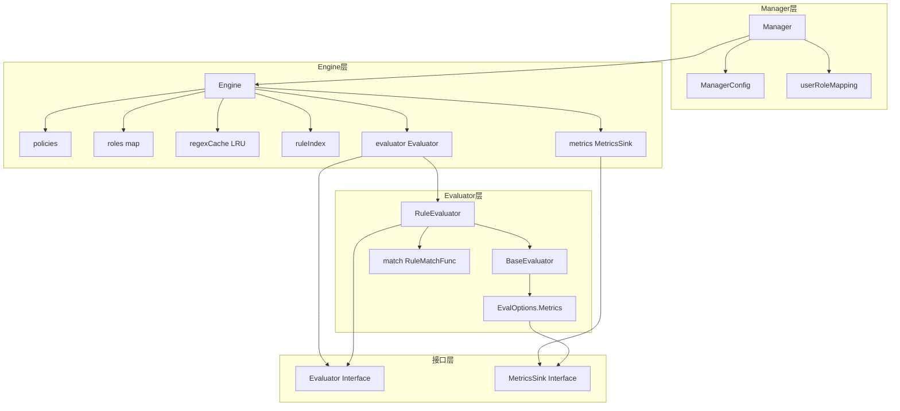
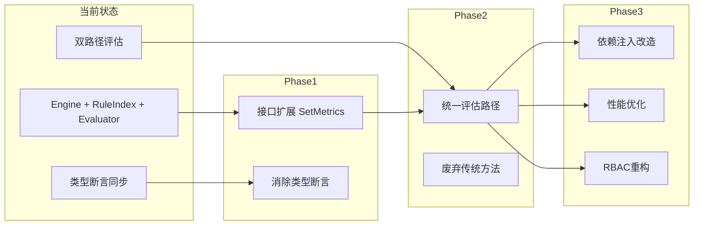

# 权限系统 Metrics 同步机制架构审查报告

## 一、本次变更概述

本次提交涉及以下文件修改：

| 文件 | 变更类型 | 说明 |
|------|----------|------|
| `README.md` | 删除 | 移除作者信息 |
| `pkg/permission/engine.go` | 新增 | 添加 metrics 初始化和同步更新逻辑 |
| `pkg/permission/evaluator.go` | 新增 | 添加 SetMetrics 方法 |

### 变更目的

实现 Engine 与 Evaluator 之间的 metrics 同步机制，确保运行时动态更新 metrics 时两者保持一致性。

---

## 二、当前架构分析

### 2.1 架构图



### 2.2 核心组件职责

| 组件 | 职责 | 关键字段 |
|------|------|----------|
| Manager | 权限管理器入口，处理用户角色映射 | userRoleMapping, enabled |
| Engine | 规则引擎核心，协调策略/角色检查 | policies, roles, ruleIndex, evaluator |
| RuleIndex | 规则索引，加速候选规则定位 | byProvider, byBucket, byPathPrefix |
| RuleEvaluator | 规则评估器，遍历候选规则做决策 | BaseEvaluator.opts.Metrics, match |
| Role | 角色定义，权限与约束条件 | Permissions, Conditions, permSet缓存 |

---

## 三、发现的问题

### 3.1 本次变更引入的设计问题 🔶

#### 问题 A: 类型断言耦合

**位置**: [`engine.go:349-351`](pkg/permission/engine.go:349)

```go
if re, ok := e.evaluator.(*RuleEvaluator); ok {
    re.SetMetrics(e.metrics)
}
```

**问题描述**:
- 使用类型断言将接口类型 `Evaluator` 强转为具体类型 `*RuleEvaluator`
- 破坏了接口抽象，限制了未来扩展性
- 注释中已提到此问题，但未给出解决方案

**建议方案**:

方案1 - 在 Evaluator 接口添加 SetMetrics 方法:
```go
type Evaluator interface {
    Evaluate(ctx context.Context, req Request, rules []Rule, roles map[string]*Role) Result
    SetMetrics(sink MetricsSink)  // 新增方法
}
```

方案2 - 使用 MetricsSetter 接口进行可选实现检测:
```go
type MetricsSetter interface {
    SetMetrics(sink MetricsSink)
}

// 在 SetMetrics 中
if setter, ok := e.evaluator.(MetricsSetter); ok {
    setter.SetMetrics(e.metrics)
}
```

#### 问题 B: metrics 初始化时机不一致

**位置**: [`engine.go:312`](pkg/permission/engine.go:312) vs [`engine.go:320`](pkg/permission/engine.go:320)

```go
// 第 312 行: Engine 初始化
metrics: NoopMetrics,

// 第 320 行: Evaluator 初始化
WithMetrics(engine.metrics),
```

**问题描述**:
- Engine 的 metrics 在结构体初始化时设置
- Evaluator 的 metrics 通过选项函数传递
- 两处设置逻辑不统一，增加维护成本

**建议**: 统一使用选项函数模式初始化 Engine。

---

### 3.2 已存在的架构问题（未修改）

#### 问题 C: 代码重复 🚨

**位置**: 
- [`engine.go:486-500`](pkg/permission/engine.go:486) - Engine.checkRoles
- [`evaluator.go:185-207`](pkg/permission/evaluator.go:185) - RoleEvaluator.Evaluate
- [`rbac.go:18-38`](pkg/permission/rbac.go:18) - RBAC.Check

**问题描述**: 三处实现相同的角色检查逻辑，存在明显代码重复。

**建议**: 使用 RoleEvaluator 替代 Engine.checkRoles，或提取公共函数。

#### 问题 D: 双重评估路径 🚨

**位置**: [`engine.go:364-424`](pkg/permission/engine.go:364)

**问题描述**:
- Check 方法存在两条评估路径：索引驱动路径 和 传统路径
- 索引路径调用 evaluator.Evaluate，传统路径调用 checkRules/checkRoles
- 两路径逻辑相似但不完全一致，增加理解难度和测试负担

**建议**: 统一使用 evaluator，废弃传统路径（保留灰度开关期间可共存）。

#### 问题 E: RBAC 与 Engine 功能重叠 🔶

**位置**: [`rbac.go`](pkg/permission/rbac.go)

**问题描述**:
- RBAC 仅提供角色检查功能
- Engine.checkRoles 已实现相同功能
- RBAC 无法独立使用，必须配合 Manager/Engine
- RoleEvaluator.Evaluate 同样实现了角色检查逻辑

**建议**: 
- 短期：保留 RBAC 作为轻量级角色检查器（适合无规则场景）
- 长期：考虑废弃 RBAC，统一使用 RoleEvaluator

#### 问题 F: 全局状态污染 🔶

**位置**: [`engine.go:26-27`](pkg/permission/engine.go:26)

```go
var pathNormalizer PathNormalizer = DefaultPathNormalizer
```

**问题描述**: 使用全局变量存储路径规范化器，影响测试可隔离性。

**建议**: 将 pathNormalizer 移入 Engine 结构体。

#### 问题 G: Manager 不必要拷贝 🔶

**位置**: [`manager.go:121-124`](pkg/permission/manager.go:121)

```go
userMapping := make(map[string][]string, len(m.userRoleMapping))
for k, v := range m.userRoleMapping {
    userMapping[k] = v
}
```

**问题描述**: 每次权限检查都复制 userRoleMapping，性能浪费。

**建议**: 已有 RWMutex 保护，直接使用引用即可。

---

## 四、优化建议

### 4.1 高优先级（立即修复）

| 序号 | 建议 | 影响 |
|------|------|------|
| 1 | 在 Evaluator 接口添加 SetMetrics 方法，消除类型断言 | 提升扩展性 |
| 2 | 统一评估路径，废弃传统 checkRules/checkRoles | 降低维护成本 |

### 4.2 中优先级（下一迭代）

| 序号 | 建议 | 影响 |
|------|------|------|
| 3 | 将 pathNormalizer 移入 Engine 结构体 | 提升测试可隔离性 |
| 4 | 移除 Manager 中的 userRoleMapping 拷贝 | 性能优化 |
| 5 | 使用 Engine 选项函数模式统一初始化 | 代码一致性 |

### 4.3 低优先级（可选）

| 序号 | 建议 | 影响 |
|------|------|------|
| 6 | 考虑废弃 RBAC，统一使用 RoleEvaluator | 减少冗余 |
| 7 | 添加 metrics 统计接口（命中率、缓存大小等） | 可观测性增强 |

---

## 五、实施建议

### 5.1 Phase 1: 接口扩展（解决本次变更遗留问题）

```go
// evaluator.go
type Evaluator interface {
    Evaluate(ctx context.Context, req Request, rules []Rule, roles map[string]*Role) Result
    SetMetrics(sink MetricsSink) // 新增
}

// engine.go SetMetrics 简化为
func (e *Engine) SetMetrics(sink MetricsSink) {
    e.mu.Lock()
    defer e.mu.Unlock()
    if sink != nil {
        e.metrics = sink
    } else {
        e.metrics = NoopMetrics
    }
    e.evaluator.SetMetrics(e.metrics) // 直接调用接口方法
}
```

### 5.2 Phase 2: 统一评估路径

```go
// engine.go Check 方法简化为
func (e *Engine) Check(ctx context.Context, req Request) Result {
    e.mu.RLock()
    candidates := e.ruleIndex.CandidatesFor(req)
    e.mu.RUnlock()
    
    // 统一使用 evaluator
    res := e.evaluator.Evaluate(ctx, req, candidates, e.roles)
    
    // 处理未命中情况
    if !res.Allowed && res.MatchedRule == "" {
        return e.defaultResult(req)
    }
    return res
}
```

### 5.3 Phase 3: 架构清理

- 移除 checkRules/checkRoles 方法
- 将 pathNormalizer 移入 Engine
- 移除 Manager 的 userRoleMapping 拷贝

---

## 六、架构演进路线图



---

## 七、结论

### 本次变更评价

本次 metrics 同步机制的实现总体合理，解决了运行时动态配置的需求。但存在以下需要改进的点：

1. **类型断言耦合**: 建议通过接口扩展解决
2. **初始化不一致**: 建议统一选项函数模式

### 长期架构建议

权限系统已具备良好的分层结构（Manager → Engine → Evaluator），建议继续演进：

1. 统一评估路径，降低维护成本
2. 消除接口破坏性设计（类型断言）
3. 完善依赖注入，提升测试性

---

**审查结论**: 本次变更 **APPROVE**，但建议后续迭代实施上述优化建议。