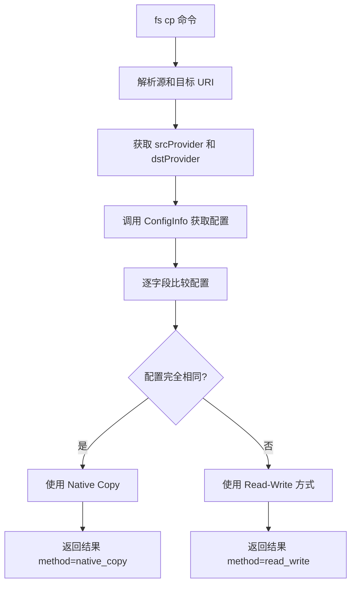

# Provider ConfigInfo 优化建议

## 概述

本次变更实现了 `fs cp` 命令的性能优化，通过比较源和目标 provider 的配置来决定是否使用原生 Copy 方法。本文档分析了现有实现并提出优化建议。

---

## 一、架构分析

### 当前实现流程



### ProviderConfigInfo 结构体

| 字段 | 说明 | S3 | OSS | COS | File | CephFS |
|------|------|----|----|-----|------|--------|
| Scheme | 协议标识 | ✓ | ✓ | ✓ | ✓ | ✓ |
| Bucket | 存储桶 | ✓ | ✓ | ✓ | - | - |
| Endpoint | 服务端点 | ✓ | ✓ | ✓ | - | - |
| AccessKey | 访问密钥 | ✓ | ✓ | ✓ | - | - |
| SecretKey | 密钥 | ✓ | ✓ | ✓ | - | - |
| PathStyle | 路径风格 | ✓ | ✓ | ✓ | - | - |
| UseSSL | SSL 设置 | ✓ | ✓ | ✓ | - | - |

---

## 二、发现的问题与优化建议

### 1. 代码重复问题 - 高优先级

**问题**: OSSProvider, COSProvider, S3CompatibleProvider 存在大量重复代码:
- [`Read()`](pkg/provider/oss_provider.go:65) 方法实现完全相同
- [`Write()`](pkg/provider/oss_provider.go:80) 方法实现完全相同
- [`Delete()`](pkg/provider/oss_provider.go:93) 方法实现完全相同
- [`List()`](pkg/provider/oss_provider.go:104) 方法实现完全相同
- [`Stat()`](pkg/provider/oss_provider.go:125) 方法实现完全相同
- [`Exists()`](pkg/provider/oss_provider.go:161) 方法实现完全相同

**建议**: 创建一个基础 S3BaseProvider 结构体，OSSProvider 和 COSProvider 通过组合复用代码:

```go
// pkg/provider/s3_base.go
type S3BaseProvider struct {
    scheme    string
    client    *s3client.Client
    bucket    string
    endpoint  string
    accessKey string
    secretKey string
    pathStyle bool
    useSSL    bool
}

func (p *S3BaseProvider) Read(ctx context.Context, key string) (io.ReadCloser, error) {
    // 共用实现
}

func (p *S3BaseProvider) ConfigInfo() ProviderConfigInfo {
    return ProviderConfigInfo{
        Scheme:    p.scheme,
        Bucket:    p.bucket,
        Endpoint:  p.endpoint,
        AccessKey: p.accessKey,
        SecretKey: p.secretKey,
        PathStyle: p.pathStyle,
        UseSSL:    p.useSSL,
    }
}

// pkg/provider/oss_provider.go
type OSSProvider struct {
    S3BaseProvider
}

func NewOSSProvider() (StorageProvider, error) {
    // 仅处理 OSS 特有的配置逻辑
    base, err := NewS3BaseProvider("oss", s3client.Config{
        PathStyle: true, // OSS 特有配置
        // ...
    })
    if err != nil {
        return nil, err
    }
    return &OSSProvider{S3BaseProvider: *base}, nil
}
```

**收益**: 减少约 60% 重复代码，维护成本降低

---

### 2. ConfigInfo 比较逻辑优化 - 中优先级

**问题**: [`cmd/fs.go:521-527`](cmd/fs.go:521) 中手动逐字段比较，代码冗长且不易维护:

```go
useNativeCopy := srcConfig.Scheme == dstConfig.Scheme &&
    srcConfig.Bucket == dstConfig.Bucket &&
    srcConfig.Endpoint == dstConfig.Endpoint &&
    srcConfig.AccessKey == dstConfig.AccessKey &&
    srcConfig.SecretKey == dstConfig.SecretKey &&
    srcConfig.PathStyle == dstConfig.PathStyle &&
    srcConfig.UseSSL == dstConfig.UseSSL
```

**建议**: 在 [`ProviderConfigInfo`](pkg/provider/provider.go:52) 结构体添加 `Equals` 方法:

```go
// pkg/provider/provider.go
func (c ProviderConfigInfo) Equals(other ProviderConfigInfo) bool {
    return c.Scheme == other.Scheme &&
        c.Bucket == other.Bucket &&
        c.Endpoint == other.Endpoint &&
        c.AccessKey == other.AccessKey &&
        c.SecretKey == other.SecretKey &&
        c.PathStyle == other.PathStyle &&
        c.UseSSL == other.UseSSL
}

// 或者使用 reflect.DeepEqual（注意性能）
func (c ProviderConfigInfo) Equals(other ProviderConfigInfo) bool {
    return reflect.DeepEqual(c, other)
}
```

**cmd/fs.go 调用简化为**:
```go
useNativeCopy := srcConfig.Equals(dstConfig)
```

---

### 3. 敏感信息安全性 - 中优先级

**问题**: [`ConfigInfo()`](pkg/provider/provider.go:92) 返回完整的 AccessKey 和 SecretKey，可能在日志、调试输出或错误信息中暴露敏感信息。

**建议方案 A**: 添加专门用于比较的方法，不返回敏感信息:

```go
// pkg/provider/provider.go
type ProviderIdentity struct {
    Scheme   string
    Bucket   string
    Endpoint string
    // 使用哈希值而非原始密钥
    AccessKeyHash string
    SecretKeyHash string
    PathStyle     bool
    UseSSL        bool
}

func (p StorageProvider) Identity() ProviderIdentity {
    // 返回不含原始密钥的标识信息
}
```

**建议方案 B**: 在日志输出时排除敏感字段:

```go
func (c ProviderConfigInfo) SafeString() string {
    return fmt.Sprintf("scheme=%s, bucket=%s, endpoint=%s, pathStyle=%v, useSSL=%v",
        c.Scheme, c.Bucket, c.Endpoint, c.PathStyle, c.UseSSL)
}
```

---

### 4. OSS/COS Provider ConfigInfo 硬编码问题 - 低优先级

**问题**: 
- [`OSSProvider.ConfigInfo()`](pkg/provider/oss_provider.go:190) 硬编码 `PathStyle: true`
- [`COSProvider.ConfigInfo()`](pkg/provider/cos_provider.go:190) 硬编码 `PathStyle: false`
- 两者都硬编码 `UseSSL: true`

这些值应该从 struct 中获取而非硬编码。虽然当前实现正确（因为这些 provider 在初始化时就固定了这些值），但代码可读性不佳。

**建议**: OSSProvider 和 COSProvider 应添加 pathStyle 和 useSSL 字段到 struct，并在 ConfigInfo 中返回:

```go
// pkg/provider/oss_provider.go
type OSSProvider struct {
    scheme    string
    client    *s3client.Client
    bucket    string
    endpoint  string
    accessKey string
    secretKey string
    pathStyle bool  // 新增
    useSSL    bool  // 新增
}

func (p *OSSProvider) ConfigInfo() ProviderConfigInfo {
    return ProviderConfigInfo{
        // ...
        PathStyle: p.pathStyle,  // 从 struct 获取
        UseSSL:    p.useSSL,     // 从 struct 获取
    }
}
```

---

### 5. 缺少单元测试覆盖 - 中优先级

**问题**: 变更未添加针对 ConfigInfo 功能的单元测试，特别是:
- 配置比较逻辑的正确性测试
- Native copy vs Read-write 选择逻辑测试

**建议**: 添加测试用例:

```go
// pkg/provider/provider_test.go
func TestProviderConfigInfoEquals(t *testing.T) {
    tests := []struct {
        name     string
        a        ProviderConfigInfo
        b        ProviderConfigInfo
        expected bool
    }{
        {
            name: "identical configs",
            a:    ProviderConfigInfo{Scheme: "s3", Bucket: "test", Endpoint: "s3.amazonaws.com"},
            b:    ProviderConfigInfo{Scheme: "s3", Bucket: "test", Endpoint: "s3.amazonaws.com"},
            expected: true,
        },
        {
            name: "different bucket",
            a:    ProviderConfigInfo{Scheme: "s3", Bucket: "test1"},
            b:    ProviderConfigInfo{Scheme: "s3", Bucket: "test2"},
            expected: false,
        },
        {
            name: "different credentials",
            a:    ProviderConfigInfo{Scheme: "s3", AccessKey: "key1", SecretKey: "secret1"},
            b:    ProviderConfigInfo{Scheme: "s3", AccessKey: "key2", SecretKey: "secret2"},
            expected: false,
        },
    }
    // ...
}
```

---

### 6. 跨 Provider 复制场景优化建议 - 低优先级

**问题**: 当前实现中，即使 scheme 相同（如都是 "s3"），但 bucket 或 endpoint 不同时，仍使用 Read-Write 方式。这对于某些云服务商可能存在更优方案。

**建议**: 添加跨 bucket 复制支持（如果云服务商支持）:

```go
// 检查是否支持跨 bucket 服务端复制
if srcConfig.Scheme == dstConfig.Scheme && 
   srcConfig.Endpoint == dstConfig.Endpoint &&
   sameAccount(srcConfig, dstConfig) {
    // 使用 CopyObject with source bucket/key format
    // copySource := srcConfig.Bucket + "/" + srcPath
}
```

---

## 三、优化实施优先级

| 优先级 | 优化项 | 预估工作量 | 收益评估 |
|--------|--------|------------|----------|
| 高 | 代码重复问题（S3BaseProvider） | 中 | 减少维护成本，提高代码质量 |
| 中 | ConfigInfo 比较逻辑优化 | 低 | 提高可读性，易于维护 |
| 中 | 敏感信息安全性 | 低 | 安全合规 |
| 中 | 单元测试覆盖 | 低 | 提高可靠性 |
| 低 | OSS/COS 硬编码问题 | 低 | 提高代码一致性 |
| 低 | 跨 Provider 复制优化 | 高 | 性能提升 |

---

## 四、推荐的优化实施步骤

### 第一阶段（建议立即实施）

1. 添加 [`ProviderConfigInfo.Equals()`](pkg/provider/provider.go:52) 方法
2. 简化 [`cmd/fs.go`](cmd/fs.go:521) 中的比较逻辑
3. 添加 ConfigInfo 相关单元测试
4. 为 OSS/COS Provider 添加 pathStyle/useSSL 字段

### 第二阶段（后续迭代）

1. 创建 S3BaseProvider 消除代码重复
2. 实现敏感信息保护机制
3. 考虑跨 bucket 复制支持

---

## 五、总结

当前变更实现了核心功能目标，代码质量良好，测试通过。但存在以下可优化空间：

1. **代码重复**: S3-based provider 存在大量重复代码
2. **比较逻辑**: 可通过添加 Equals 方法简化
3. **安全性**: 敏感信息可能暴露风险
4. **测试覆盖**: 缺少针对性单元测试

建议按优先级逐步实施优化，第一阶段的低工作量优化可立即进行。