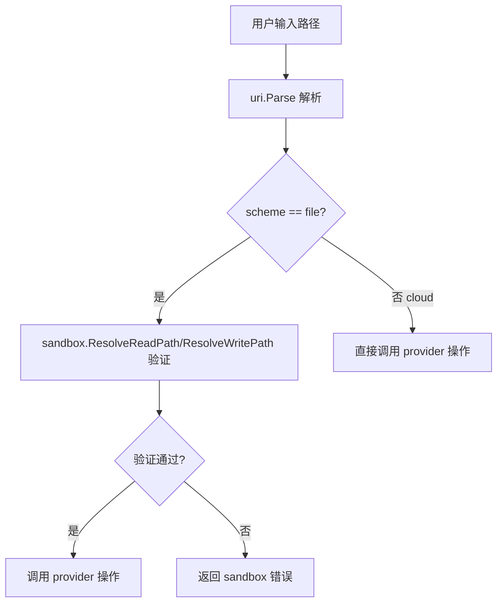

当前进度说明: ✅ 所有任务已完成。`cmd/fs.go` 中 `file://` scheme 的所有相关函数（runFsRead、runFsLs、runFsCp）均已添加 `sandbox.ResolveReadPath` 验证，可有效阻止路径遍历攻击。

# Sandbox 安全恢复方案

## 问题概述

在将 `local` 和 `cloud` 命令合并为统一的 `fs` 命令时，原有的 sandbox 安全验证被意外移除。

### 原有安全机制

[`pkg/sandbox/path.go`](pkg/sandbox/path.go:13) 提供了路径安全验证：
- 通过 `AFS_WORKSPACE` 环境变量定义工作空间根目录
- [`ResolveReadPath()`](pkg/sandbox/path.go:13) 和 [`ResolveWritePath()`](pkg/sandbox/path.go:17) 验证用户请求的路径是否在工作空间内
- 阻止路径遍历攻击，防止访问 `/etc/passwd`、`/root/.ssh/id_rsa` 等敏感文件

### 当前问题

新的 [`cmd/fs.go`](cmd/fs.go:133) 直接将用户输入的路径传递给 `FileProvider`，绕过了 sandbox 验证：

```go
func runFsRead(path string) error {
    parsed, err := uri.Parse(path)
    // 直接使用 parsed.Path，无 sandbox 验证
    ...
    rc, err := p.Read(ctx, filePath)  // 可读取任意路径
}
```

## 解决方案

### 方案选择：在 cmd/fs.go 层面添加验证

选择此方案的原因：
1. `cmd/fs.go` 是用户输入的入口点，在此处验证最符合安全设计原则
2. 保持 `pkg/provider/file_provider.go` 纯粹，便于测试和复用
3. sandbox 验证只适用于 `file://` scheme，在入口点判断更清晰
4. 与原有 `cmd/local.go` 的设计模式一致

### 实现步骤



### 需要修改的函数

[`cmd/fs.go`](cmd/fs.go) 中需要添加 sandbox 验证的函数：

| 函数 | 行号 | 操作类型 | sandbox 函数 |
|------|------|----------|--------------|
| `runFsRead` | 133 | 读 | `ResolveReadPath` |
| `runFsLs` | 388 | 读 | `ResolveReadPath` |
| `runFsCp` | 422 | 读+写 | `ResolveReadPath` + `ResolveWritePath` |
| `runFsInfo` | 499 | 读 | `ResolveReadPath` |

### 修改示例

```go
func runFsRead(path string) error {
    parsed, err := uri.Parse(path)
    if err != nil {
        return apperr.New("fs_read", apperr.CodeInvalidArg, fmt.Sprintf("invalid path: %v", err))
    }

    ctx := context.Background()
    p, err := provider.Get(ctx, parsed.Scheme)
    if err != nil {
        available := provider.SupportedSchemes()
        return apperr.New("fs_read", apperr.CodeNotFound,
            fmt.Sprintf("provider not found for scheme: %s. Available: %v", parsed.Scheme, available))
    }

    // Get the path based on scheme
    var filePath string
    switch parsed.Scheme {
    case "file", "cephfs":
        filePath = parsed.Path
        // ADDED: Sandbox validation for file scheme
        if parsed.Scheme == "file" {
            resolvedPath, err := sandbox.ResolveReadPath(filePath)
            if err != nil {
                return err  // sandbox error already wrapped
            }
            filePath = resolvedPath
        }
    default:
        filePath = parsed.Key
    }
    // ... rest of the function
}
```

## 测试计划

### 测试场景

1. **正常访问**：`AFS_WORKSPACE=/workspace`，访问 `/workspace/file.txt` → 成功
2. **路径遍历阻止**：`AFS_WORKSPACE=/workspace`，访问 `/workspace/../etc/passwd` → 拒绝
3. **绝对路径阻止**：`AFS_WORKSPACE=/workspace`，访问 `/etc/passwd` → 拒绝
4. **无限制模式**：未设置 `AFS_WORKSPACE`，访问任意路径 → 成功（向后兼容）
5. **云存储不受影响**：访问 `s3://bucket/key` → 不经过 sandbox

### 测试代码示例

```go
func TestFsReadWithSandbox(t *testing.T) {
    os.Setenv("AFS_WORKSPACE", "/tmp/workspace")
    defer os.Unsetenv("AFS_WORKSPACE")
    
    // 创建测试文件
    os.MkdirAll("/tmp/workspace", 0755)
    os.WriteFile("/tmp/workspace/test.txt", []byte("hello"), 0644)
    
    // 正常访问应该成功
    err := runFsRead("/tmp/workspace/test.txt")
    assert.NoError(t, err)
    
    // 路径遍历应该被阻止
    err = runFsRead("/tmp/workspace/../etc/passwd")
    assert.Error(t, err)
    assert.Contains(t, err.Error(), "access denied")
}
```

## TODO 清单

- [ ] 在 `cmd/fs.go` 中导入 `sandbox` 包
- [ ] 在 `runFsRead` 函数中为 `file://` scheme 添加 `sandbox.ResolveReadPath` 验证
- [ ] 在 `runFsLs` 函数中添加 sandbox 验证
- [ ] 在 `runFsCp` 函数中对源路径和目标路径分别添加 `ResolveReadPath` 和 `ResolveWritePath` 验证
- [ ] 在 `runFsInfo` 函数中添加 sandbox 验证
- [ ] 在 `runFsURL` 函数中对 `cephfs://` scheme 添加 sandbox 验证（如果适用）
- [ ] 添加单元测试验证 sandbox 功能正常工作
- [ ] 运行完整测试套件确保不破坏现有功能
- [ ] 更新文档说明 sandbox 安全机制

## 备注

- `cephfs://` scheme 可能需要不同的安全策略，待确认
- 此修复不应影响云存储（s3、r2、minio 等）的操作